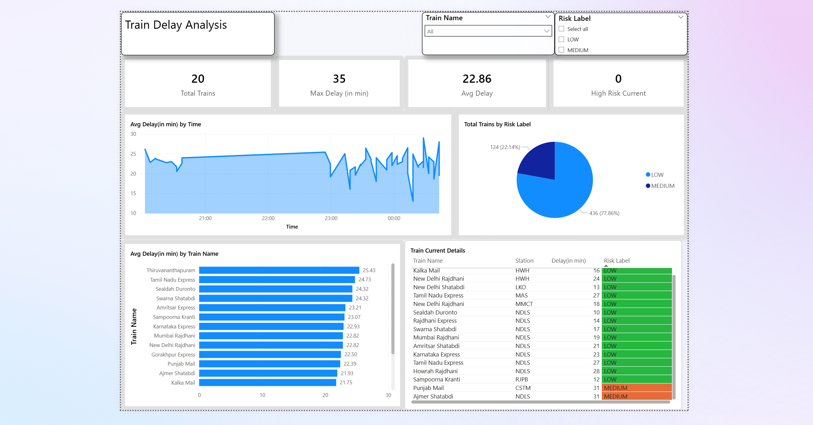

# 🚆 Rail Delay Tracker


A **real-time railway delay simulation pipeline** with automated scheduling, risk classification, and an interactive Power BI dashboard for delay trend monitoring and analysis.

The project demonstrates a complete end-to-end data engineering workflow:

```
Scheduler → Simulator → CSV / PostgreSQL → Power BI Dashboard
```

---

## 📸 Dashboard Preview



---

## ✨ Features

- 🚂 Simulates real-time train delays with per-train delay profiles
- ⚠️ Classifies risk levels — **HIGH / MEDIUM / LOW** — based on delay severity
- 📊 Maintains a rolling time-series dataset (last 10 records per train)
- 🗄️ Dual storage — CSV fallback + optional PostgreSQL
- 📈 Interactive Power BI dashboard with trend & risk insights
- 🔄 Fully automated pipeline via APScheduler (runs every 5 minutes)

---

## 📊 Dashboard Insights

- 📈 Delay trend over time
- ⚠️ Risk distribution across trains
- 🚂 Top delayed trains
- 📋 Latest snapshot of live train status

---

## 🏗️ Architecture

```
┌─────────────┐     ┌──────────────┐     ┌─────────────────────┐     ┌──────────────────┐
│ scheduler.py│────▶│ simulator.py │────▶│ data/train_history  │────▶│ Power BI Dashboard│
│ (every 5min)│     │ (delay gen + │     │ .csv  +  PostgreSQL │     │  dashboard.pbix   │
└─────────────┘     │  risk logic) │     └─────────────────────┘     └──────────────────┘
                    └──────────────┘
```

---

## 📁 Project Structure

```
Rail-Delay-Tracker/
│
├── simulator.py        # Generates train delay data + risk classification
├── scheduler.py        # Runs pipeline every 5 minutes via APScheduler
├── train_list.py       # Train metadata (train_no, train_name, source station)
├── schema.py           # PostgreSQL table schema definitions
├── queries.py          # Reusable SQL query helpers for DB reads/writes
├── export.py           # Aggregated data export utilities
│
├── data/
│   └── train_history.csv   # Rolling time-series dataset
│
├── dashboard.pbix      # Power BI dashboard file
├── Dashboard.png       # Dashboard screenshot
│
├── .env.example        # Environment variable template
├── .gitignore
├── requirements.txt
└── README.md
```

---

## 🛠️ Tech Stack

| Layer | Technology | Purpose |
|---|---|---|
| Language | Python 3 | Core logic |
| Data Processing | Pandas | CSV handling, aggregation |
| Scheduling | APScheduler | Automated pipeline runs |
| Database (optional) | PostgreSQL + SQLAlchemy | Structured storage |
| Timezone | pytz | IST-aware timestamps |
| Visualization | Power BI | Interactive dashboard |
| Config | python-dotenv | Environment variable management |

---

## ⚙️ Risk Classification Logic

| Delay | Risk Level |
|---|---|
| > 60 minutes | 🔴 HIGH |
| 30 – 60 minutes | 🟡 MEDIUM |
| < 30 minutes | 🟢 LOW |

---

## 🚀 Getting Started

### 1. Clone the repository
```bash
git clone https://github.com/Saksham3124/Rail-Delay-Tracker.git
cd Rail-Delay-Tracker
```

### 2. Create a virtual environment
```bash
python -m venv venv
```

**Windows:**
```bash
venv\Scripts\activate
```

**Mac/Linux:**
```bash
source venv/bin/activate
```

### 3. Install dependencies
```bash
pip install -r requirements.txt
```

### 4. Configure environment variables
```bash
cp .env.example .env
```
Then edit `.env` and set your `DB_URL` if you want PostgreSQL storage. If you skip this, the pipeline will use CSV-only mode automatically.

### 5. Set up the database (optional)
```bash
python schema.py
```

### 6. Run the scheduler
```bash
python scheduler.py
```

The pipeline will run once immediately, then repeat every 5 minutes. Data is saved to `data/train_history.csv` (and PostgreSQL if configured).

### 7. Open the Power BI dashboard
Open `dashboard.pbix` in Power BI Desktop and refresh the data source to point to your local `data/train_history.csv`.

---

## 📝 Notes

- Data is stored in `data/train_history.csv`
- Only the last **10 records per train** are retained to keep the file lean
- PostgreSQL is optional — the pipeline works fully in CSV-only mode
- The dashboard refreshes dynamically as new data is written

---

## 🗺️ Roadmap / Future Improvements

- [ ] Real API integration (Indian Railways / NTES live data)
- [ ] Deployment on cloud (AWS / GCP)
- [ ] Stream processing with Apache Kafka + Spark
- [ ] Advanced predictive analytics (ML delay forecasting)
- [ ] Email/SMS alerts for HIGH risk trains

---

## 👤 Author

**Saksham**
B.Tech Student — BIT Mesra

[](https://github.com/Saksham3124)

---

## ⭐ Support

If this project was useful to you, consider giving it a star ⭐ on GitHub!
